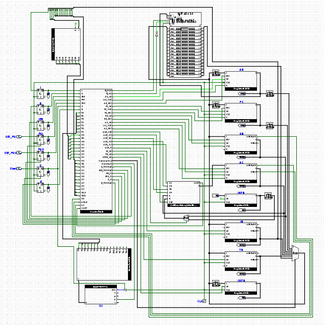
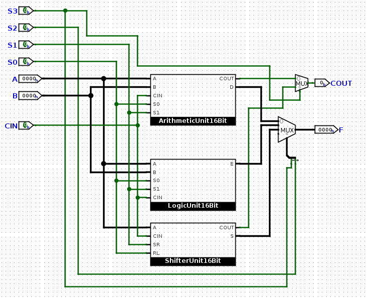

# Mano Machine in Logisim Evolution

A working 16-bit Mano Machine (the Basic Computer from M. Morris Mano's *Computer System Architecture*), built from basic logic gates in Logisim Evolution, with a hardwired control unit, a common bus and interrupt-driven I/O.


**At a glance:** 16-bit stored-program CPU · 25 instructions · 35 custom subcircuits · 4K × 16 memory · hardwired control

## Demo

<!-- TODO: Add a GIF of a program running on the Mano Machine, e.g.  -->



**Author:** Abdul Rafay  
**Course:** Computer Architecture Lab Project  
**Tool:** Logisim Evolution 3.8.0  

---

## Contents

- [Overview](#overview)
- [Highlights](#highlights)
- [Architecture](#architecture)
- [Instruction Set](#instruction-set)
- [Subcircuits](#subcircuits)
- [Circuit Snapshots](#circuit-snapshots)
- [Testing and Verification](#testing-and-verification)
- [How to Run](#how-to-run)
- [Repository Structure](#repository-structure)

---

## Overview

The **Mano Machine** is a complete processor implementation of the **Basic Computer** architecture described in *M. Morris Mano’s Computer System Architecture, Chapter 5 (Basic Computer Organization and Design)*.  
This project was designed and verified using **Logisim Evolution**, following the principles of register transfer logic, bus-based data movement, and hardwired control.

All modules — from arithmetic units to control logic — were built from fundamental logic components, demonstrating the working of a simple stored-program computer.

---

## Highlights

- **Custom building blocks:** registers, counters, full adders, decoders, the 16-bit ALU and the control unit are all custom subcircuits. Apart from basic gates, multiplexers and wiring, the only Logisim built-ins are the RAM, D/T flip-flops, the clock, and the 8-bit adder inside `Adder8Bit`.
- **Hardwired control:** a 4-bit sequence counter and a 4-to-16 decoder produce the timing signals T0–T15. Each register, the memory, the bus and the ALU has its own control subcircuit that turns those timing signals and the decoded opcode into control signals.
- **Full instruction cycle:** fetch, decode, indirect addressing and execute for all 25 instructions.
- **Interrupts and I/O:** INPR/OUTR with the FGI/FGO flags, plus IEN and R flip-flops for the interrupt cycle.
- **Modular:** 35 reusable subcircuits, from a 1-bit full adder up to the full 16-bit ALU.

---

## Architecture

| Component | Description |
|------------|--------------|
| **Control Unit** | Generates the control signals for every register, the bus, memory, and the ALU on each clock pulse (hardwired control). |
| **Registers** | AC, DR, AR, IR, PC, TR, INPR, OUTR — each implemented as a subcircuit (8, 12, or 16 bits). |
| **Bus System** | A shared 16-bit data path connecting all registers and Memory. |
| **ALU (Arithmetic Logic Unit)** | Performs arithmetic and logical micro-operations using 16-bit Full Adder, Logic Unit, and Shifter Unit. |
| **Memory Unit** | 4096 × 16-bit memory used to store programs and data. |
| **I/O Interface** | Basic input/output implemented through INPR and OUTR registers. |
| **Flip-flops** | I (addressing mode), E (carry/extension), S (start/stop), R (interrupt), IEN (interrupt enable), FGI and FGO (I/O flags). |
| **Timing** | 4-bit sequence counter (SC) and 4-to-16 decoder producing T0–T15; 3-to-8 decoder producing D0–D7 from the opcode. |

### Register Summary

| Register | Bits | Purpose |
|----------|------|---------|
| AC | 16 | Accumulator |
| DR | 16 | Data register (holds the memory operand) |
| IR | 16 | Instruction register |
| TR | 16 | Temporary register |
| AR | 12 | Address register (drives the memory address) |
| PC | 12 | Program counter |
| INPR | 8 | Input character |
| OUTR | 8 | Output character |

### Instruction Format

```
 15  14 13 12  11                          0
┌───┬─────────┬─────────────────────────────┐
│ I │ Opcode  │           Address           │
└───┴─────────┴─────────────────────────────┘
```

- **Opcode 000–110:** memory-reference instruction. `I = 0` is direct addressing and `I = 1` is indirect.
- **Opcode 111, I = 0:** register-reference instruction (bits 0–11 select the operation).
- **Opcode 111, I = 1:** input-output instruction (bits 0–11 select the operation).

### Instruction Cycle

| Timing | Micro-operation |
|--------|-----------------|
| T0 | AR ← PC |
| T1 | IR ← M[AR], PC ← PC + 1 |
| T2 | Decode IR(12–14) into D0–D7, AR ← IR(0–11), I ← IR(15) |
| T3 | Indirect: AR ← M[AR] · or execute a register-reference or I/O instruction |
| T4+ | Execute the memory-reference instruction, then SC ← 0 |

When IEN is set and an I/O flag is raised, R is set and the next cycle is an interrupt cycle instead of a fetch. It saves PC at address 0 and branches to address 1.

---

## Instruction Set

Hex codes follow Mano's encoding. For memory-reference instructions, the first digit is the opcode with I = 0 (direct) or I = 1 (indirect), and `xxx` is the 12-bit address.

### Memory-Reference Instructions
| Mnemonic | Hex (I=0 / I=1) | Description | Example |
|-----------|-----------------|--------------|----------|
| `AND` | `0xxx` / `8xxx` | Logical AND of AC and memory | `AND 300` |
| `ADD` | `1xxx` / `9xxx` | Add memory word to AC | `ADD 305` |
| `LDA` | `2xxx` / `Axxx` | Load memory word to AC | `LDA 310` |
| `STA` | `3xxx` / `Bxxx` | Store AC into memory | `STA 312` |
| `BUN` | `4xxx` / `Cxxx` | Branch unconditionally | `BUN 400` |
| `BSA` | `5xxx` / `Dxxx` | Branch and save return address | `BSA 402` |
| `ISZ` | `6xxx` / `Exxx` | Increment and skip if zero | `ISZ 405` |

### Register-Reference Instructions
| Mnemonic | Hex | Description |
|-----------|-----|--------------|
| `CLA` | `7800` | Clear AC |
| `CLE` | `7400` | Clear E |
| `CMA` | `7200` | Complement AC |
| `CME` | `7100` | Complement E |
| `CIR` | `7080` | Circular right shift AC & E |
| `CIL` | `7040` | Circular left shift AC & E |
| `INC` | `7020` | Increment AC |
| `SPA` | `7010` | Skip next if AC positive |
| `SNA` | `7008` | Skip next if AC negative |
| `SZA` | `7004` | Skip next if AC zero |
| `SZE` | `7002` | Skip next if E zero |
| `HLT` | `7001` | Halt computer |

### I/O Instructions
| Mnemonic | Hex | Description |
|-----------|-----|--------------|
| `INP` | `F800` | Input from input register |
| `OUT` | `F400` | Output to output register |
| `SKI` | `F200` | Skip if input flag set |
| `SKO` | `F100` | Skip if output flag set |
| `ION` | `F080` | Interrupt enable |
| `IOF` | `F040` | Interrupt disable |

---

## Subcircuits

All 35 custom subcircuits in `Processor.circ`, grouped by role:

| Group | Subcircuits |
|-------|-------------|
| **Registers & counters** | `Register4Bit`, `Register8Bit`, `Register12Bit`, `Register16Bit`, `Counter4Bit` |
| **Arithmetic & logic** | `FullAdder1Bit`, `FullAdder4Bit`, `Adder8Bit`, `FullAdder12Bit`, `FullAdder16Bit`, `ArithmeticUnit16Bit`, `LogicUnit16Bit`, `ShifterUnit16Bit`, `ArithmeticLogicUnit16Bit` |
| **Decoders & encoders** | `Decoder2Bit`, `Decoder3Bit`, `Decoder4Bit`, `Encoder3Bit` |
| **Control unit** | `ControlUnit`, which contains one control subcircuit per component: `ControlUnitAR`, `ControlUnitPC`, `ControlUnitDR`, `ControlUnitIR`, `ControlUnitAC`, `ControlUnitTR`, `ControlUnitOUTR`, `ControlUnitMemory`, `ControlUnitCommonBus`, `ControlUnitALU`, `ControlUnitCounter`, `ControlUnitE`, `ControlUnitS`, `ControlUnitR`, `ControlUnitIEN`, `ControlUnitFGIO` |

Each module was constructed using basic logic gates and multiplexers to simulate microoperations accurately.

---

## Circuit Snapshots

### Main CPU View


### ALU Module


---

## Testing and Verification

All **hexadecimal programs from Morris Mano’s textbook** were loaded into the memory and executed successfully.  
Each instruction was verified step-by-step using the manual clock and control signals.

✅ Achieved **Full Marks** for correctness and design clarity.

---

## How to Run

1. Install [Logisim Evolution](https://github.com/logisim-evolution/logisim-evolution) (the circuit was built with v3.8.0).
2. Clone this repository and open `Processor.circ`:
   ```sh
   git clone https://github.com/abdurafay19/mano-machine-logisim.git
   ```
3. Load a program: right-click the **Memory** RAM in the `main` circuit, choose **Load Image…**, and pick your hex file.
4. Run it: use **Simulate → Auto-Tick Enabled** for continuous execution, or tick the clock by hand to step through one clock pulse at a time.
5. Watch AC, PC, AR, IR, SC and the flags change to follow the instruction cycle in real time.

---

## Repository Structure

```
mano-machine-logisim/
├── Processor.circ      # Complete Logisim Evolution project (main CPU + 35 subcircuits)
├── screenshots/        # Circuit renders used in this README
├── LICENSE
└── README.md
```

---

## Author

**Abdul Rafay**  
Computer Architecture Lab Project  
[GitHub Profile](https://github.com/abdurafay19)
[LinkedIn Profile](https://www.linkedin.com/in/abdurafay19)

---

## Academic Integrity Notice

© 2025 Abdul Rafay — All Rights Reserved.  
This project is published for educational viewing only.

Reusing, modifying, or submitting this work (in whole or in part) for any
academic assessment, coursework, or lab project by others is strictly
prohibited and may constitute academic misconduct.
